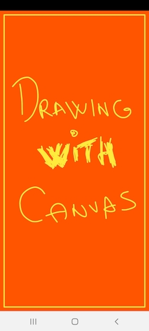

# :art: Drawing on Canvas Object - MiniPaint

This is the toy app for Lesson 5 of the Advanced Android Apps with Kotlin course on [Udacity](https://www.udacity.com/).

## :framed_picture: MiniPaint App 

MiniPaint is an example about how to use Canvas and let the user draw on it with Kotlin!

This app demonstrates the following views and techniques:

* Bitmap Class to save the drawing in the cache
* Path Class to create an empty Path to draw on the Canvas.
* Canvas Class to make the drawing possible for the user.
* Paint Class to implement basic styles to the CustomView.
* MotionEvent Class to report movements event.

## :camera_flash: Screenshots

